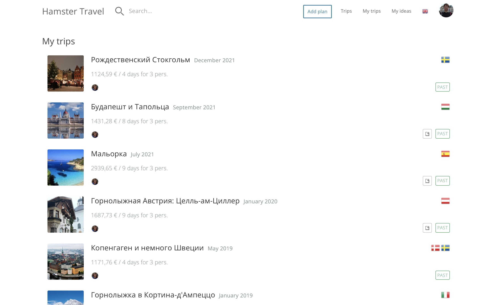
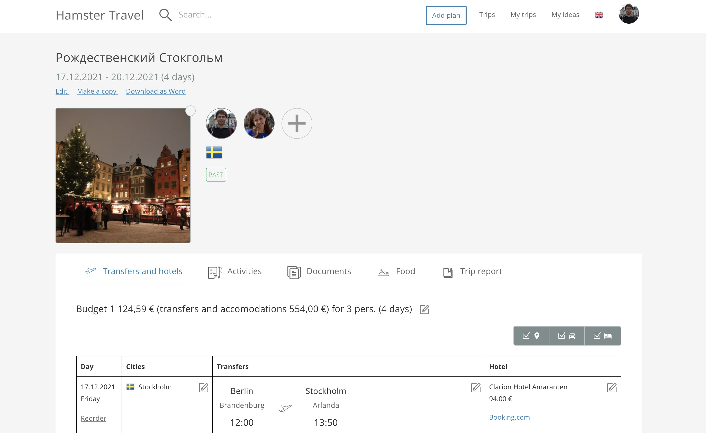
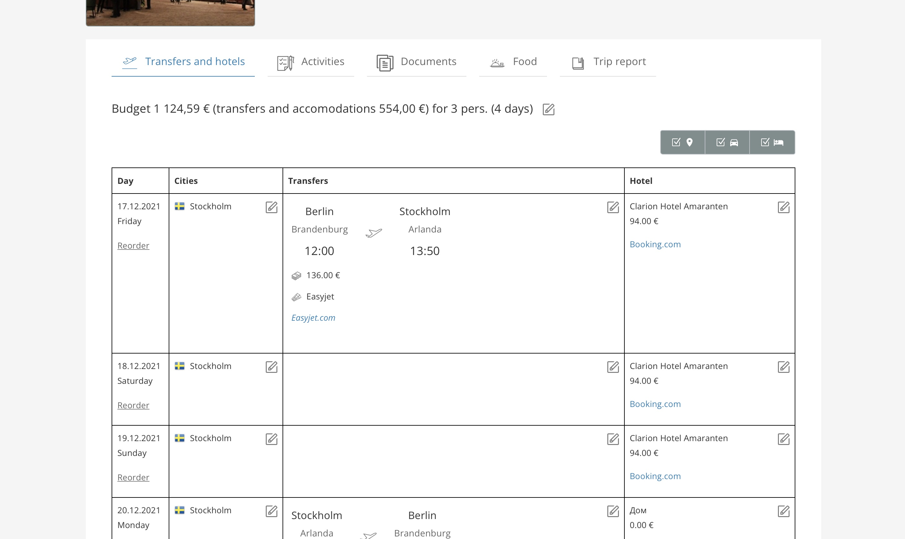
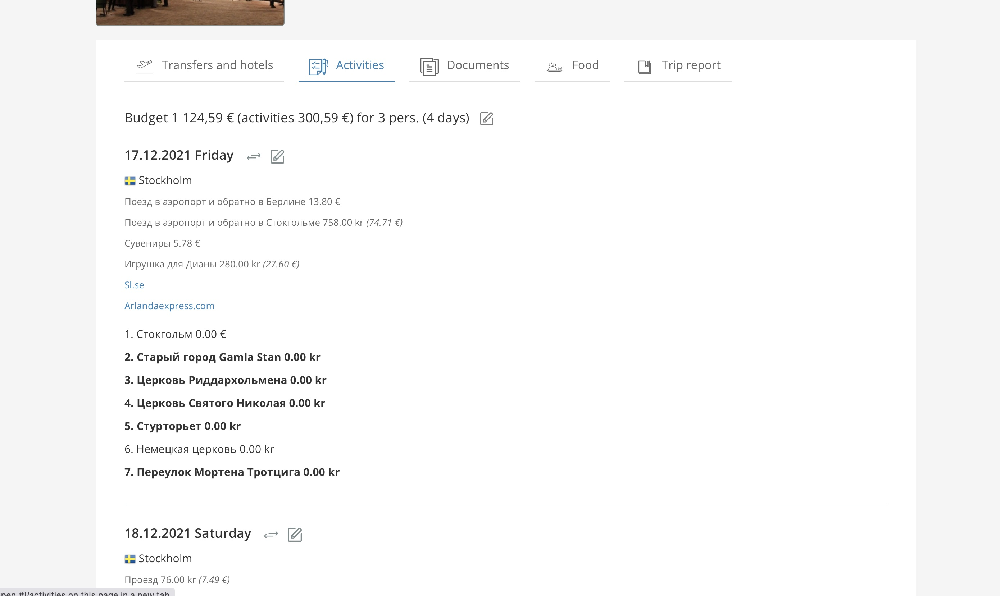
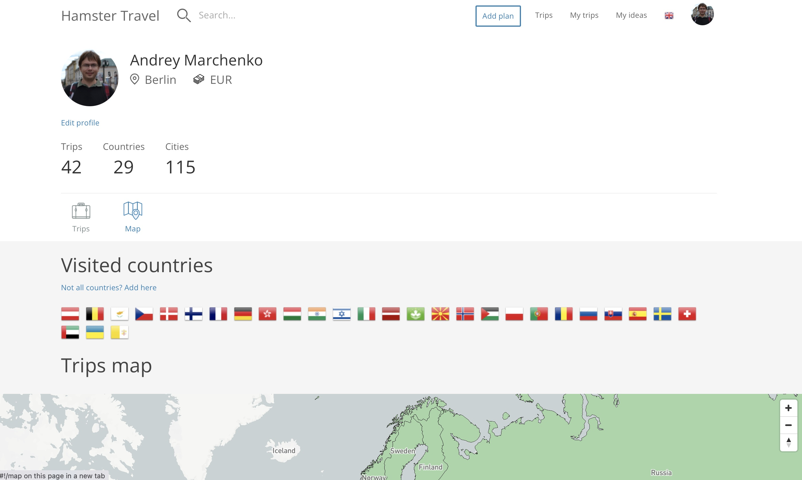
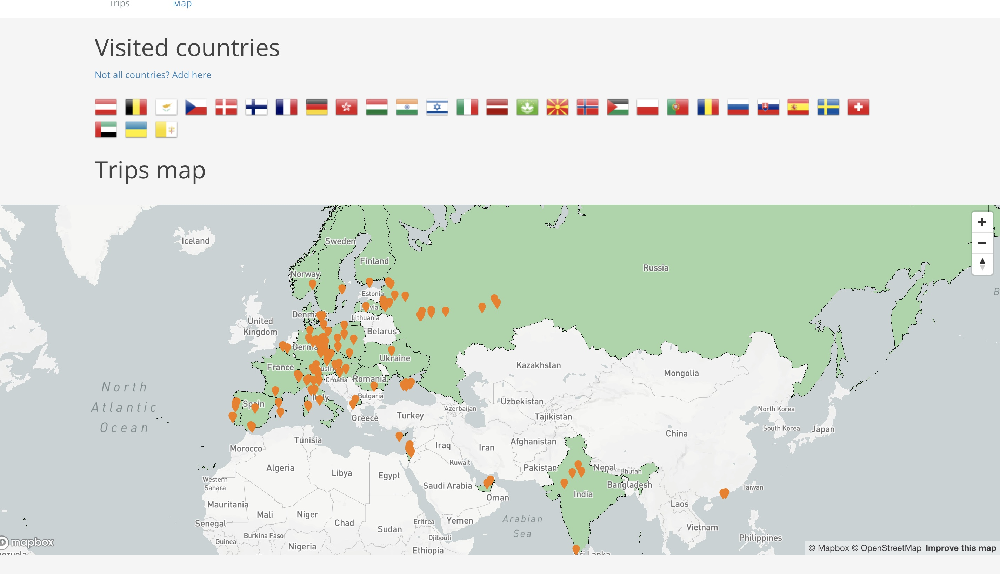

<ProjectLinks
  links={[
    {
      type: 'website',
      url: 'https://travel.hmstr.rocks/en/landing',
      label: 'Hamster Travel',
    },
  ]}
></ProjectLinks>

Traveling is one of my biggest passions in life (besides programming). It also became the main theme for my very first side project - our very own travel planning application that we create with my wife since 2014. It allows us to create plans what to visit, track our flights and hotels and most importantly calculates an overall budget for a trip. We have been using this app for many years now and it became an essential tool in our lives.

### Features

1. Trip planning
   1. Plan transfers and hotel stays
   2. Plan activities (what to visit/what to do)
   3. Track expected meal expenses, information about local cuisine
   4. Securely upload documents (like boarding passes or tickets)
   5. Calculate an overall trip budget (with multiple currencies support)
2. User profile
   1. Show all visited countries by user
   2. Show travels map with visited countries painted green and visited cities marked with pins

### Tech stack

Currently the project is undergoing a major rewrite! The current version was developed using ruby on rails and angular 1.0. The new version is being developed in elixir and phoenix using LiveView. This page will be updated when it’s done.

### Screenshots

Trips list

Trip page

Trip page - transfers tab

Trip page - activities tab

User profile

User profile - travels map

