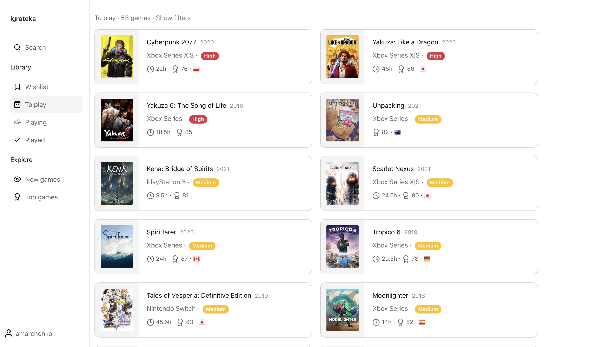
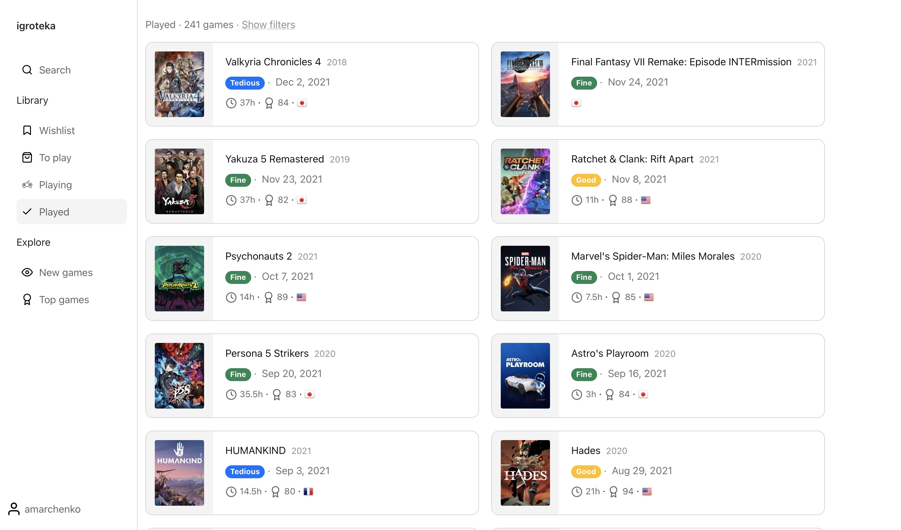
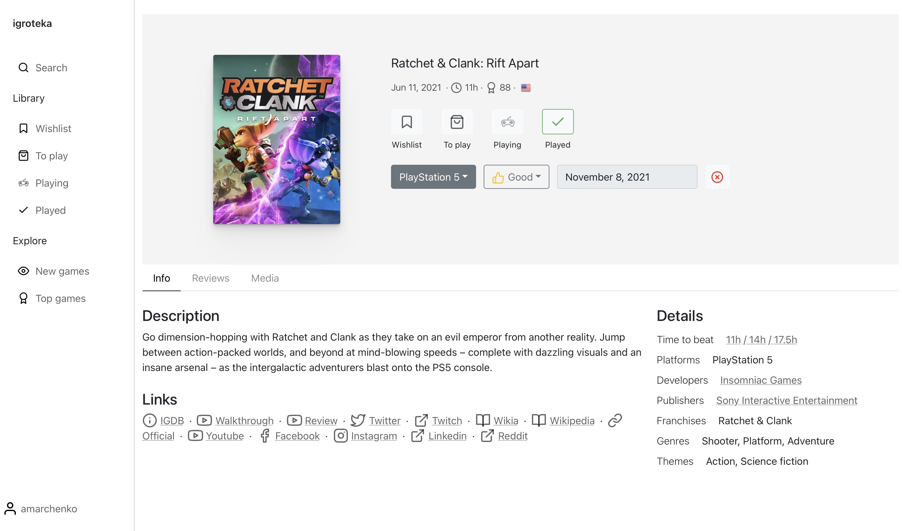
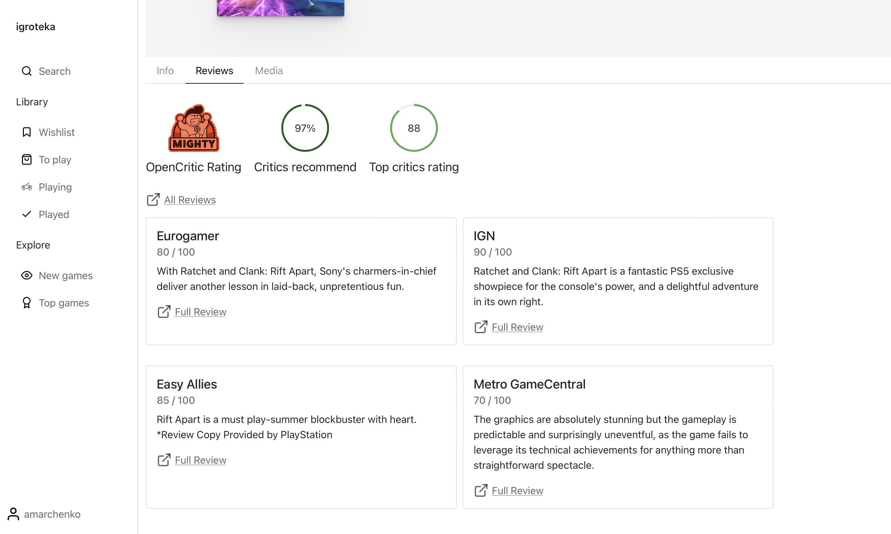
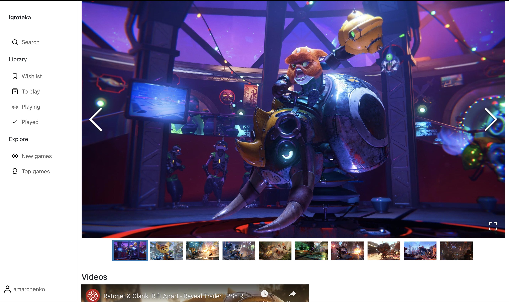

<ProjectLinks
  links={[
    {
      type: 'website',
      url: 'https://igroteka.de',
      label: 'Igroteka',
    },
    {
      type: 'github',
      url: 'https://github.com/altmer/igroteka',
      label: 'Frontend code',
    },
    {
      type: 'github',
      url: 'https://github.com/altmer/skaro',
      label: 'Backend code',
    },
  ]}
></ProjectLinks>

Gaming backlog. A [lot](https://kotaku.com/how-to-chip-away-at-a-massive-games-backlog-1845794480)
[is](https://www.wired.com/story/get-through-overflowing-game-library-game-backlog/)
[written](https://www.online-tech-tips.com/gaming/6-tips-to-manage-your-massive-gaming-backlog/)
about it. This is a common knowledge that many gamers are not actually playing games,
but just collecting them in an endless backlog.

So how do I beat it? Especially now, when I don't have enough time to play games? I
needed a very good tool to manage my gaming backlog to be able to prioritise games I want
to play the most (or the ones I can finish faster at least). There are several existing
ways to do that: using your note taking app (like
[Trello](https://trello.com/power-ups/5e32b07c80a9cd1d0e7e5e8e/gaming-backlog) or
[Notion](https://www.notion.so/Video-game-tracker-7adee9d8f02d485793fd4503b60e591d))
or specialised app (like [GameTrack](https://gametrack.app) or [Grouvee](https://www.grouvee.com)).
None of these worked for me though: I couldn't get myself to use them. The only solution
left is to build it myself!

### Features

1. Showing game information
   1. display a page with basic information about a game
   2. show critic rating and critic reviews for the game
   3. show approximately how long would it take to finish the game
   4. show screenshots and videos for every game
2. Manage backlog
   1. add a game to my backlog and put in one of the following lists: "Wishlist”, “To play”, “Currently playing”, “Played”
   2. save additional information about a game in my backlog like platform (PC, PS5, etc), priority in the backlog or how much did I enjoy this game
3. Exploration
   1. search games by name
   2. show new and noteworthy games
   3. show top games by year (based on critics reviews)
   4. implement a company page showing games developed or published by this company

### Data sources

So there are three main data sources I needed for this project:

- games data
- game reviews
- how long is the game

There are several public API providers with games data, the most popular ones
being [Giantbomb](https://www.giantbomb.com) and [IGDB](https://www.igdb.com/discover)
(owned by Twitch). Giantbomb has not a lot of data and really weird community behind it:
when one tries to help and add more data to their website, these changes get rejected
because content “is not unique enough”, so there is no hope that Giantbomb will ever
have enough data. So while I went with Giantbomb for an initial implementation,
I switched to IGDB later and was very happy with this move.

For the game reviews [Opencritic](https://opencritic.com) is an awesome choice.
Very high data quality and great JSON API to use.

The main source of data to answer the question “how long is this game” is
definitely the [howlongtobeat.com](http://howlongtobeat.com) website. It
does not have an API so I implemented simple scraper to get this data.

### Tech stack

Backend:

- elixir
- phoenix
- postgresql
- guardian (for authorization)
- httpoison (making http calls to external APIs)
- con_cache (ttl cache - all the external calls are heavily cached)
- sentry (errors monitoring)
- floki (HTML parser for parsing howlongtobeat website)
- mox (testing library for behaviour based testing)
- bypass (mock server for external APIs)

Frontend:

- react (via creat-react-app)
- redux
- redux-saga
- react-router
- bootstrap (via reactstrap)

### Screenshots

Backlog - games to play

Backlog - played

Game page

Game page - reviews

Game page - media

