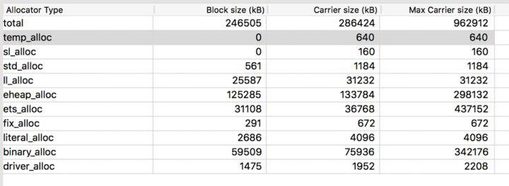
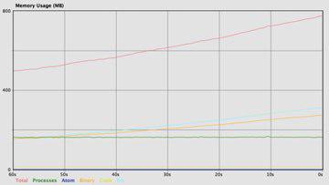

_This article was originally published on Kloeckner.i [blog](https://blog.kloeckner-i.com/building-a-data-import-pipeline-using-genstage-and-flow/)._

I have been working for kloeckner.i which is a part of Kloeckner & Co holding working on digitizing of everything related to steel trading business. We create products that help Kloeckner to provide services and sell steel with some modern fancy tech (that is, the Internet). Our technology stack is mostly based
on Ruby on Rails and Elixir/Phoenix applications.

One of the most important topics for us is the import of data from external systems (ex. the ERP system of a regional Kloeckner organization). My colleague Florian Kraft has recently written an amazing [blogpost](https://floriank.github.io/post/the-steel-industry-file_fdw-and-postgres/) that describes this process in more detail.

Here is short summary of the import process:

- Business data (products, customers, orders, etc) is stored in ERP (external)
- Data is exported in CSV format to a folder on the SFTP server
- Our tools monitor this folder and import data in one of the following ways (depending on application):
  1. Direct import with ruby script (the simplest case)
  2. Using file_fdw functionality of Postgresql (before mentioned blogpost from Florian covers this case)
  3. With concurrent import pipelines built upon GenStage in elixir (I will elaborate on this below)

## Why don't we _just_ import data directly?

Data we receive comes in many types, forms and flavors, but one thing is true for all - it is rarely easy to map the provided information to our data model, as we process data differently from other ERP systems.

Such difficulties may include:

- One CSV file can contain data for several data models (for example orders and shipments)
- CSV rows can contain duplicate IDs (because of the above)
- Rows can also contain no ID at all (in this case we have to construct an ID)
- We have to derive certain values based on complicated rules (for example order statuses)
- Complex aggregations (number of pending orders, product quantities in our warehouse etc)

This is the reason why we have to pre-process before importing data into our database. This can be very time and memory consuming when it comes big datasets. Also, code of our imports became overly complicated quickly.

## Import data using GenStage and Flow

Nowadays we use Elixir extensively and hence started exploring the opportunities it has to offer. And there are a few! In 2016 the core elixir team [introduced](https://elixir-lang.org/blog/2016/07/14/announcing-genstage/) [GenStage](https://github.com/elixir-lang/gen_stage) behavior which allows us to create event flows between elixir processes (producer/consumer setups). Later, a [Flow](https://github.com/elixir-lang/flow) library was created providing a high level interface on top of GenStage for concurrent data processing: A perfect match for our importing needs. So, let's get started!

Let us consider the following example: We have to import a set of products into the Postgresql database from a csv file. First, we have to precompute some product properties based on the customer's order history, in order to show more aggregated info without hitting the database with joins every time a product table is displayed (for example to show the number of pending pieces ordered).

Here is a simplified example of a products.csv file:

```csv
PRODUCT_NUMBER|PRICE|COMMODITY|SHORT_DESC
HE3443|307.39|Coil|COIL 145 x 45 x x 4
GU964|826.04|Tube|GU 33 x 44 x 44
LZ87534|60.03|Coil|L 23 Z
```

And here are orders.csv:

```csv
ORDER_NUMBER|LINE_STATUS|PRODUCT_NUMBER|ORDERED_PIECES|SHIPPED_PIECES|BILL_OF_LADING
order-0|Closed|HE3443|1234|1234|bill-number
order-1|Closed|HE3443|1|0|
order-2|Closed|HE3443|4000|1200|12
order-2|Open|HE3443|4000|2000|
order-3|Closed|HE3443|4000|1200|1235
order-3|Closed|HE3443|4000|2800|344
order-4|Open|HE3443|4000|1000|543543543
order-4|Closed|HE3443|4000|2800|543543
order-5|Closed|HE3443|1234|1234|bill-number
```

All columns are self-explanatory (except maybe [bill of lading](https://en.wikipedia.org/wiki/Bill_of_lading)).

There are also a few business rules related to this data:

- There are repeating order IDs - so that each order appears multiple times throughout the file (representing multiple shipments)
- An order is considered to be pending if at least one row contains the line status “Open” and there is no bill of lading (order-2 above)
- If the order status is “Closed” and there is no bill of lading (order-1 above) - shipment did not take place and the order should be ignored
- Number of pending pieces for pending order: ORDERED_PIECES minus sum of SHIPPED_PIECES over all not ignored rows.

Pretty simple, huh? (not really!)

```elixir
defmodule GenstageImporter.Product do
  @moduledoc """
  Products schema
  """
  use Ecto.Schema

  schema "products"do
    # fields from products.csv file
    field(:product_number, :string)
    field(:external_id, :string)
    field(:description, :string)
    field(:commodity, :string)
    field(:price, :decimal)

    # precomputed fields from orders.csv
    # true if at least one order is present for the product
    field(:orders_present, :boolean)
    # true if at least one pending order is present
    field(:pending_orders_present, :boolean)
    # sum of pending (left to ship) pieces over all orders for the product
    field(:pending_pieces, :integer)

    timestamps()
  end
end
```

In order to achieve that we designed the following data pipeline:

1. Preprocess orders.csv in memory to produce key-value data structure that lets us fetch pending_pieces, pending_orders_present, orders_present for any given product_number quickly
2. Read products.csv file and merge data from csv rows with data precomputed during the previous step (joined by product_number)
3. Send resulting events to a sink that splits flow in batches and inserts them into database while keeping track of inserted IDs
4. Calculate a difference between IDs we have in our database and last imported IDs to delete entities that are no longer

Let's illustrate each step in code (I am only showing the main pipeline logic here, the full code can be found [here](https://github.com/altmer/genstage_importer)).

Preprocess orders.csv (1):

```elixir
defmodule GenstageImporter.Pipeline.Order do
  def import() do
    # ETS table that stores the end result
    products = :ets.new(:products_order_status, [])
    pid = self()

    try do
      orders_path()
      |> File.stream!(read_ahead: 100_000)
      |> CSV.decode!(separator:?|, headers: true)
      # initial flow is created from file input stream
      |> Flow.from_enumerable()
      # we immediately filter out rows to be ignored
      |> Flow.filter(&valid/1)
      # as early as possible transform original map to a smaller one to save memory
      |> Flow.map(fn row ->
        %{
          order_number: row["ORDER_NUMBER"],
          product_number: row["PRODUCT_NUMBER"],
          ordered_pieces: Parser.parse_integer(row["ORDERED_PIECES"]),
          shipped_pieces: Parser.parse_integer(row["SHIPPED_PIECES"]),
          pending: pending(row)
        }
      end)
      # here input flow is partitioned and sent to 4 concurrent stages
      # also, we ensure that events with the same order_number go to the same stage
      |> Flow.partition(key: {:key, :order_number}, stages: 4)
      # this step reduces incoming event to an ETS table with aggregated information about each order
      |> Flow.reduce(fn -> :ets.new(:orders, []) end, fn row, table ->
        order_number = row[:order_number]
        {_, _, shipped_pieces, pending} = ETS.fetch_order(table, order_number)
        ETS.insert_order(
          table,
          order_number,
          row[:product_number],
          row[:ordered_pieces],
          shipped_pieces + row[:shipped_pieces],
          pending || row[:pending]
        )
      end)
      # after reduce process is done, next stage is triggered
      # here we give away ETS table ownership to the parent process, flow is done
      # at this stage
      |> Flow.on_trigger(fn ets ->
        :ets.give_away(ets, pid, [])
        {[ets], ets}
      end)
      # foreach result, we iterate over orders table andcalculate aggregated values for products
      |> Enum.to_list()
      |> Enum.each(fn table ->
        ETS.each_order(table, &process_order/2)
        :ets.delete(table)
      end)
      # endresult to be returned
      products
    rescue
      ex ->
        :ets.delete(products)
        reraise(ex, System.stacktrace())
    end
  end
end
```

Import products pipeline (2):

```elixir
defmodule GenstageImporter.Pipeline.Product do
  defimportdo
    # preprocess orders, get a reference to ETS table
    table_ref = Order.import()

    try do
    # here the straightforward flow
      products_path()
      |> File.stream!(read_ahead: 100_000)
      |> CSV.decode!(separator:?|, headers: true) |> Flow.from_enumerable()
      |> Flow.map(&transform(&1, table_ref))
      |> Flow.partition()
      |> EctoImporter.import(Product)

      Logger.info("Import done in#{:os.system_time(:millisecond) - time_in_millis}ms")
    after
     :ets.delete(table_ref)
    end
  end
 # merge CSV values with precomputed orders data
  defp transform(row, table_ref) do
    product_number = row["PRODUCT_NUMBER"]
    {pending, pending_pieces, orders_present} = ETS.fetch_product(table_ref, product_number)
    price = Parser.parse_decimal(row["PRICE"])

    %{
      external_id: product_number,
      product_number: product_number,
      description: row["SHORT_DESC"],
      price: price,
      commodity: row["COMMODITY"],
      pending_orders_present: pending,
      orders_present: orders_present,
      pending_pieces: pending_pieces
    }
  end
end
```

Insert into database (3, 4):

```elixir
defmodule GenstageImporter.EctoImporter do
  @moduledoc """
  Contains functions that import input stream to specified ecto schema.
  Also handles deletes of items that are no longer in CSV files.
  """
 aliasGenstageImporter.Repo
 aliasFlow.Window, as:FlowWindow

  import Ecto.Query, only:[from:2]

  defimport(input_flow, schema) do
    input_flow
    |> split_in_batches()
    |> upsert(schema)
    |> delete(schema)
  end

  defp split_in_batches(input_flow) do
    input_flow
    |> Flow.partition(window:FlowWindow.count(1_000), stages:4)
    |> Flow.reduce(fn -> [] end, fn item, batch -> [item | batch] end)
  end

  defp upsert(input_flow, schema) do
    input_flow
    |> Flow.on_trigger(fn items ->
      Repo.insert_all(
        schema,
        add_timestamps(items),
        on_conflict: :replace_all,
        conflict_target: :external_id
      )
      {Enum.map(items, & &1.external_id), items}
    end)
    |> Enum.to_list()
    |> MapSet.new()
 end

  defp delete(imported_ids, schema) do
    query = from(p inschema, select: p.external_id)
    existing_ids = query |> Repo.all() |> MapSet.new()
    ids_to_delete = existing_ids |> MapSet.difference(imported_ids) |> MapSet.to_list()

    ids_to_delete
    |> Enum.chunk_every(1_000) |> Enum.map(fn ids ->
      delete_query =
       from(p inschema, where: p.external_id in^ids )
      Repo.delete_all(delete_query)
    end)
  end

  defp add_timestamps(items) do
    items
    |> Enum.map(fn item ->
      item
      |> Map.put(:inserted_at, DateTime.utc_now())
      |> Map.put(:updated_at, DateTime.utc_now())
    end)
  end
end
```

In order to test this setup I generated 500 000 products and 2 500 000 corresponding orders. Here are some results (from MacBook Pro 2017, 3,5 GHz Intel Core i7):

Preprocessing time **103** seconds.

Import time **33** seconds.

Memory report (maximum **963Mb** is used):



## Learnings

### 1. Erlang has great profiling tools

Actually standard Erlang [observer](http://erlang.org/doc/apps/observer/observer_ug.html) tool is sufficient in most cases.
It provides you with a ton of info about running VM and is included with your Elixir or Erlang distribution. Just run :observer.start() from your iex session.

### 2. Use ETS

Elixir structs are inefficient in terms of memory. If you need to precompute something and store massive amounts of data - use ETS.

### 3. Get rid of unnecessary data at the earliest stage

CSV parser produces maps containing a lot of data - if you only need subsets of this data, transform it to smaller objects as early as possible. Also, if you do not need all events - filter first.

### 4. Take advantage of concurrency

Don't hesitate to set stage counts which are no less than equal to the number of available CPUs - you will see notable improvements in performance

### 5. Tweak number of simultaneously processed events

Don't pull too much data at once as the memory footprint can grow immensely. You can change back pressure settings using
min_demands and max_demands parameters in most Flow functions. Usually it works fine on default settings, however sometimes
it can be beneficial to pull out more data at once (for example when dealing with a slow IO).

In this case always look how your heap size (eheap_alloc in observer memory tab) is growing - if it grows in big bounces then something is definately wrong.

Here is an optimized flow memory graph:



Memory usage is growing linearly and is proportional to the ETS table size.

Here on the other hand is an example showcasing overproducing stages:


The processes heap space is growing too fast indicated by strong bouncing.

## Conclusion

So far this approach has worked great for our “harder than trivial” pipelines. It showcases better performance with nice and clean code.

Of course, there are some cons:

- There is no way of upserting only changed rows for now - we can only tell if the whole file changed or not
- It still consumes quite a lot of memory
- You have to write tailored pipeline for every special case that occurs (well, don't you do it anyway?)

You can have a look at the full source code for this example [here](https://github.com/altmer/genstage_importer). Feel free to add issues or ask questions
