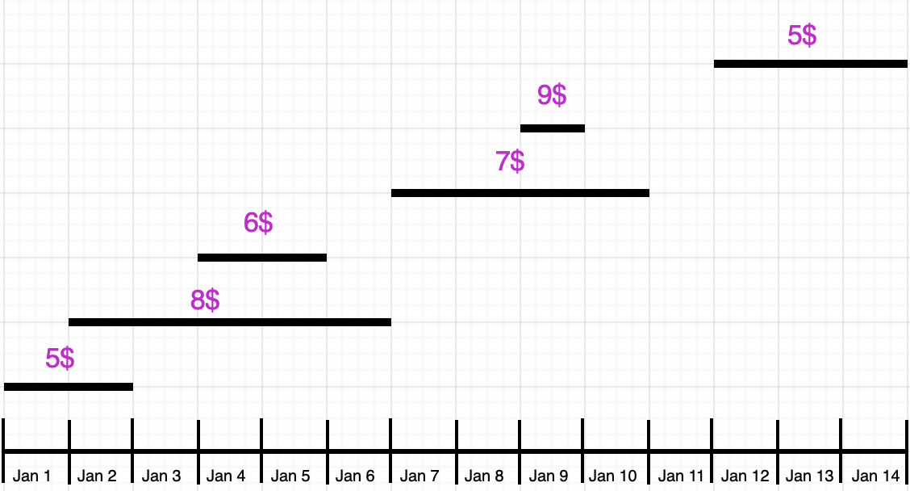

While working on a large scale pricing system I had to implement an interesting feature: dynamic pricing, i.e.
an ability to change price of any product on a day to day basis. Input for this would be provided by ML model, so there should fast and easy to use interface to create these daily prices. Surprisingly enough there is not a lot written on this topic, so I will shortly document my solution here.

### Requirements

- pricing experts want to modify prices on day-by-day basis
- the application should be able to show prices calendar from today and up to 365 days in the future
- we should be able to upload prices in batches and one by one
- prices are treated as contracts: they are never deleted and never modified so that any historical value can be used in the future for price calculations

### Implementation idea

The main idea is to define prices on dates intervals and allow them to override each other. The override rule is very simple: prices that are created later override all previous prices for the given day.

For example: we create price with value **5.0** for **Jan 01 - Jan 02**. Later on 1st of January we see that we are getting overbooked and decide to increase price from Jan 02 onwards To do that we need only to create a new price record with new increased price for the date interval **Jan 02 - Jan 06**.

Consider the following example. Here each of the priced intervals is a single price record and the order of creation goes from bottom to top (that is bottom price record was created first and the top one was created last)



_Fig. 1. Price intervals_

In this example the following prices are defined:

- Jan 01: **5$**
- Jan 02 - 03: **8$**
- Jan 04 - 05: **6$**
- Jan 06: **8$**
- Jan 07 - 08: **7$**
- Jan 09: **9$**
- Jan 10: **7$**
- Jan 11: base_price from product
- Jan 12 - 14: **5$**

### Data model

Let’s say we have a rails e-commerce app. We have `Product` model backed by `products` table that has decimal `base_rice` column (it defines baseline price that is used when no price for date is defined). Here is what corresponding `prices` table would look like (as a rails migration):

```ruby
create_table "prices", force: :cascade do |t|
  t.bigint "product_id", null: false
  t.decimal "value", null: false
  t.date "start_date", null: false
  t.date "end_date", null: false

	# timestamps
  t.datetime "created_at", null: false
  t.datetime "updated_at", null: false
end
```

And here is the corresponding active_record model (with some validations and scope):

```ruby
class Price < ApplicationRecord
  belongs_to :product, optional: false
  validates :start_date, :end_date, presence: true

  validates :value,
            presence: true,
            numericality: { greater_than: 0 }

  scope :has_days_in_date_range, lambda { |from_date, to_date|
    where('start_date <= ? AND end_date >= ?', from_date, to_date)
  }
end
```

### Querying data

In order to find out which price is valid at any given moment (defined by timestamp) we use this query:

```ruby
module Prices
  class Finder
    def initialize(timestamp:, product_id:)
      @timestamp = timestamp
      @product_id = product_id
    end

    def perform
      Price.has_days_in_date_range(@timestamp, @timestamp)
        .where(product_id: product_id)
        .order(created_at: :desc)
        .limit(1)
        .first
    end
  end
end
```

There is a catch though! As prices are never deleted and new prices are generated automatically and uploaded all the time, the `prices` table grows very quickly: after the first couple of months this table already had about 8 mln. rows.

So it was very important to have a proper index for this query.

First we added index like that:

```ruby
# spoiler: it didn't work
add_index :prices, %i[product_id start_date end_date created_at]
```

We were quite sure that this index will make queries fast enough so that we would not worry about it. We were wrong: soon enough our database queries became extremely slow (about 30s) and the whole system started to become unresponsive. After doing EXPLAIN on the generated query I was very surprised to see that Postgres is actually doing a full scan using index on a single `created_at` field.

After some research it turned out that the issue was that using `ORDER BY` and `LIMIT 1` in a single query very often makes postgres choose making full scan on an index for a field that is used in order by clause (in this case `created_at`) hoping that matching row will be found soon enough. While sometimes it can be the case, it wasn’t true for our data: with 100 000s of prices uploaded in batches this algorithm had to scan too many rows to produce result.

Correct index for this case should satisfy 2 conditions:

1. If this is a compound index, then field that is used in `ORDER BY` must be the first in a field list
2. Index should be ordered by above mentioned field in the same direction as used in the query

So the correct index definition is just like that:

```ruby
add_index :prices,
          %i[created_at product_id start_date end_date],
          order: { created_at: :desc }
```

With this index the query takes only 20-30ms on 20+ millions of rows.

### Building prices calendar for the next 365 days

And the last task we need to implement is showing the price calendar.

This snippet generates price intervals (only for the dates with our custom prices defined, for all other dates the `base_price` field will be used). This calendar can be later cached in any way we like (in memory/redis/elasticsearch/etc) and rebuilt on every new price upload.

```ruby
class PriceCalendarBuilder
  DAYS_LIMIT = 365

  def initialize(prices)
    @prices = prices
  end

  def calendar
    return [] if @prices.blank?
    raw_intervals = @prices.map { |pm| price_to_interval(pm) }

    schedule = create_day_by_day_schedule(raw_intervals)
		merge_price_intervals(schedule)
  end

  private

  def create_day_by_day_schedule(intervals)
    schedule = {}
    (Time.zone.today..max_end_date_limited).map do |day|
      price = find_price_for_day(day, intervals)
      schedule[day] = price if price.present?
    end
    schedule
  end

  def merge_price_intervals(schedule)
    result = []
    current_interval = nil
    schedule.keys.sort.each do |day|
      price_for_day = schedule[day]

      if current_interval.blank?
        current_interval = build_interval(day, price_for_day)
      elsif same_price_id?(price_for_day, current_interval)
        current_interval[:end_date] = day
      else
        result << current_interval
        current_interval = build_interval(day, price_for_day)
      end
    end
    result << current_interval
    result
  end

  def find_price_for_day(day, intervals)
    res = nil
    intervals.each do |interval|
      next unless intersect?(interval, day)
      res = latest_created(res, interval)
    end
    res
  end

  def price_to_interval(price)
    {
      id: price_interval.id,
      value: price.value.to_s,
      start_date: price_interval.start_date,
      end_date: price_interval.end_date,
      created_at: price_interval.created_at
    }
  end

  def build_interval(day, interval)
    {
      id: interval[:id],
      value: interval[:value],
      start_date: day,
      end_date: day
    }
  end

  def max_end_date_limited
    [max_end_date, Time.zone.today + DAYS_LIMIT.days].min
  end

  def max_end_date
    @max_end_date ||= @prices.map(&:end_date).max
  end

  def intersect?(interval, day)
    day >= interval[:start_date] && day <= interval[:end_date]
  end

  def latest_created(left, right)
    return right if left.blank?
    left[:created_at] > right[:created_at] ? left : right
  end

  def same_price_id?(left, right)
    left[:id] == right[:id]
  end
end

```

### Conclusion

This simple model worked really well for this use case and it has allowed us to create a very robust API to ingest dynamic prices, cache them and serve to the customers.
